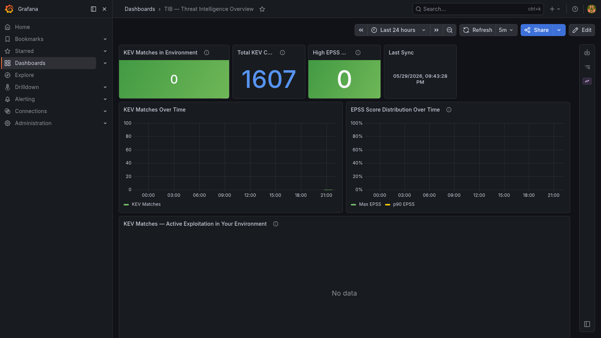

# TIB — Threat Intelligence in a Box

**One `docker compose up` to know which CVEs in your running containers are being actively exploited in the wild.**

TIB syncs the [CISA KEV catalog](https://www.cisa.gov/known-exploited-vulnerabilities-catalog) and [EPSS exploitation probability scores](https://www.first.org/epss/), cross-references them against your [VIB](https://github.com/matijazezelj/vib) vulnerability data, and surfaces the answer in Grafana: *"Out of 2,400 CVEs in my environment, 3 are on CISA KEV with active exploitation — fix those first."*

No API keys required. No cloud accounts. Fully self-hosted.

Part of the [in-a-box-tools](https://in-a-box-tools.tech) ecosystem.



---

## What you get

| Feed | Description |
|------|-------------|
| **CISA KEV** | ~1,200 CVEs with confirmed exploitation in the wild — the authoritative "fix these now" list |
| **EPSS** | Exploitation probability score (0–1) from FIRST.org — prioritise your patching backlog |

Cross-referenced against your VIB environment:
- Which of your running CVEs are on KEV?
- Which have the highest exploitation probability?
- Which are linked to ransomware campaigns?

---

## Quick start

```bash
git clone https://github.com/matijazezelj/tib.git
cd tib
cp .env.example .env
# optional: point VIB_VICTORIAMETRICS_URL to your VIB instance
make up
```

Open **http://localhost:3002** — login `admin` / your `GRAFANA_ADMIN_PASSWORD`.

---

## Requirements

- Docker + Docker Compose v2
- Outbound internet access (to pull CISA KEV and EPSS feeds)
- Optional: a running [VIB](https://github.com/matijazezelj/vib) instance for CVE cross-referencing

---

## Configuration

| Variable | Default | Description |
|----------|---------|-------------|
| `GRAFANA_ADMIN_PASSWORD` | `changeme` | Grafana admin password — set this before exposing Grafana |
| `BIND_ADDR` | `127.0.0.1` | Interface the published ports bind to; `0.0.0.0` to expose on the LAN |
| `GRAFANA_PORT` | `3002` | Host port for Grafana |
| `VICTORIAMETRICS_PORT` | `8430` | Host port for VictoriaMetrics |
| `SYNC_INTERVAL_HOURS` | `6` | Feed sync frequency |
| `SYNC_ON_STARTUP` | `true` | Sync feeds immediately on start |
| `VIB_VICTORIAMETRICS_URL` | — | VIB's VictoriaMetrics URL for CVE correlation |

### Connecting to VIB

If VIB is on the same Docker host:

```env
VIB_VICTORIAMETRICS_URL=http://host-ip:8429
```

Or put both stacks on a shared Docker network and use the container name:

```env
VIB_VICTORIAMETRICS_URL=http://vib-victoriametrics:8428
```

---

## Metrics

| Metric | Labels | Description |
|--------|--------|-------------|
| `tib_kev_matches_in_environment` | — | Number of KEV CVEs found in your environment |
| `tib_kev_match` | `cve_id`, `image`, `severity`, `vendor`, `product`, `due_date`, `ransomware` | 1 per active KEV match |
| `tib_cve_epss_score` | `cve_id`, `image`, `severity` | EPSS exploitation probability (0–1) |
| `tib_cve_epss_percentile` | `cve_id`, `image` | EPSS percentile rank |
| `tib_kev_total` | — | Total CVEs in CISA KEV catalog |
| `tib_feed_entries_total` | `feed` | Entries per feed |
| `tib_last_sync_timestamp` | `feed` | Last successful sync timestamp |

---

## Useful commands

```bash
make up          # start the stack
make down        # stop
make logs        # follow all container logs
make sync-now    # trigger an immediate sync
make build       # rebuild collector image
make clean       # stop and delete all volumes
```

---

## In-a-box ecosystem

| Tool | What it does |
|------|-------------|
| [VIB](https://github.com/matijazezelj/vib) | Vulnerability in a Box — CVE scanning of running containers |
| [SIB](https://github.com/matijazezelj/sib) | Security Intelligence in a Box — alert triage via LLM |
| [AIB](https://github.com/matijazezelj/aib) | Asset Inventory in a Box — asset graph |
| **TIB** | **Threat Intelligence in a Box** |

---

## License

MIT
